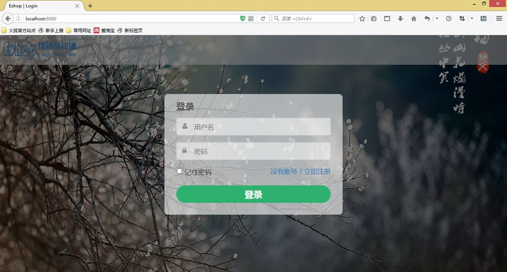
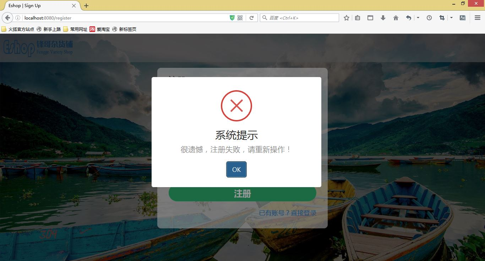

# eshop

### 开发环境说明
* 开发平台 ： IntelliJ IDEA
* JDK版本 ： jdk1.7及以上
* 服务器 ： Tomcat7及以上
* 数据库 ： MySQL
* 前端框架及插件： BootStrap，datatable, sweet-alert
* 后台框架 ： Spring+SpringMVC+Mybatis+Maven

使用时创建数据库shop,编码为utf8，用户名root，密码123456，然后导入shop.sql文件完成数据表的创建。

### 运行效果

